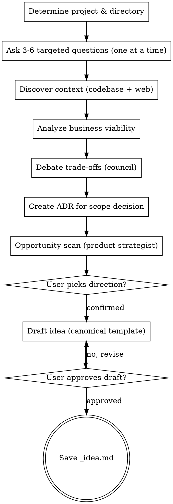

# Idea Factory

Expand a raw feature idea into a structured, research-backed spec that serves as the foundation for PRD creation.

<HARD-GATE>
Do NOT write the idea file until ALL phases are complete and the user has approved the final draft.
Do NOT skip the research phase — every idea MUST be enriched with market data.
Do NOT skip user interactions — the user MUST participate in shaping the idea at every decision point.
This applies to EVERY idea regardless of perceived simplicity.
</HARD-GATE>

## Asking Questions

When this skill instructs you to ask the user a question, you MUST use your runtime's dedicated interactive question tool — the tool or function that presents a question to the user and **pauses execution until the user responds**. Do not output questions as plain assistant text and continue generating; always use the mechanism that blocks until the user has answered.

If your runtime does not provide such a tool, present the question as your complete message and stop generating. Do not answer your own question or proceed without user input.

## Anti-Pattern: "This Idea Is Too Simple For Full Research"

Every idea goes through the full research and debate process. A single button, a minor workflow tweak, a configuration option — all of them. "Simple" ideas are where unexamined business assumptions cause the most rework downstream in the PRD. The process can be brief for genuinely simple ideas, but you MUST research and debate before writing.

## Required Inputs

- Feature idea or problem description.
- Optional: existing `_idea.md` file for update mode.

## Checklist

You MUST create a task for each phase and complete them in order:

1. **Determine project & directory** — derive slug, create `.compozy/tasks/<slug>/` and `adrs/`
2. **Understand the idea** — ask 3-6 targeted questions to refine scope and intent
3. **Research the market** — web research for competitive intelligence and market data + codebase exploration
4. **Analyze business viability** — adopt business analyst persona (`references/business-analyst.md`) for KPIs, personas, and success metrics
5. **Debate trade-offs** — run council session (`references/council.md`) to challenge assumptions and surface risks
6. **Scan for opportunities** — adopt product strategist persona (`references/product-strategist.md`) to suggest higher-leverage alternatives before committing to the draft
7. **Draft the idea** — write using the canonical template from `references/idea-template.md`
8. **Review with user** — present the draft, iterate until approved
9. **Save the file** — write to `.compozy/tasks/<slug>/_idea.md`

## Workflow

1. Determine the project name and working directory.
   - Derive the slug from the feature idea provided by the user.
   - Use `.compozy/tasks/<slug>/` as the target directory.
   - If `_idea.md` already exists in the target directory, read it and operate in update mode.
   - If the directory does not exist, create it.
   - Create `.compozy/tasks/<slug>/adrs/` directory if it does not exist.

2. Understand the idea through targeted questions.
   - Follow the question protocol in `references/question-protocol.md`.
   - Ask 3-6 questions to refine scope, intent, target user, and success criteria.
   - Ask only one question per message.
   - Prefer multiple-choice questions when the options can be predetermined.
   - Include a fallback option (e.g., "D) Other — describe") for flexibility.
   - Complete at least one full clarification round before proceeding to research.

3. Discover context through parallel research.
   - Spawn one Agent tool call to explore the codebase for relevant patterns, existing features, and architecture.
   - Spawn a second Agent tool call to perform 3-7 web searches for market data and competitive intelligence.
   - Use any available web search tools. If none are available, note the limitation and proceed with codebase exploration only.
   - Vary query angles across at least 3 searches:
     1. **Competitive landscape:** `"{feature category} tools for {domain} 2025 2026"`
     2. **Market data:** `"{problem} market size OR adoption rate OR statistics"`
     3. **Technical approach:** `"{technical solution} architecture OR implementation best practices"`
     4. **User expectations:** `"{feature} UX patterns OR user experience best practices"` (if relevant)
     5. **Pricing/cost:** `"{service/API} pricing OR cost comparison 2025 2026"` (if relevant)
   - After both agents complete, merge findings and present a research summary to the user:

     ```
     **Codebase findings:**
     - {Relevant existing feature/pattern}
     - {Integration point}

     **Market research:**
     - {Competitor 1}: {what it does}
     - {Competitor 2}: {what it does}
     - **Potential differentiator:** {what we can do differently}
     - **Relevant data:** {statistics found}
     ```

4. Analyze business viability.
   - Read `references/business-analyst.md` and adopt the business analyst persona to evaluate the idea with the refined context from steps 2-3.
   - Deliver: KPI framework, success metrics, personas, and viability assessment.
   - Define 3-6 KPIs with measurable targets.
   - Identify success criteria and risk factors.
   - Assess viability based on research findings.
   - Score the feature on these 6 criteria:

     | Criteria            | Question                                            | Score                     |
     | ------------------- | --------------------------------------------------- | ------------------------- |
     | **Impact**          | How much more valuable does this make the product?  | Must do/Strong/Maybe/Pass |
     | **Reach**           | What % of users would this affect?                  | Must do/Strong/Maybe/Pass |
     | **Frequency**       | How often would users encounter this value?         | Must do/Strong/Maybe/Pass |
     | **Differentiation** | Does this set us apart or just match competitors?   | Must do/Strong/Maybe/Pass |
     | **Defensibility**   | Is this easy to copy or does it compound over time? | Must do/Strong/Maybe/Pass |
     | **Feasibility**     | Can we actually build this?                         | Must do/Strong/Maybe/Pass |

   - This evaluation informs the idea's priority and feeds into the council debate.
   - Present the analysis to the user before proceeding.

5. Debate trade-offs through multi-advisor council.
   - Read `references/council.md` and run a council session in embedded mode to debate:
     - **Scope:** Is the V1 scope right? Too much? Too little?
     - **Priority:** Where should this rank vs other planned features?
     - **Technical approach:** Are there simpler alternatives?
     - **Risks:** What could go wrong? What are the hidden dependencies?
     - **10x Challenge:** Is this truly high-leverage or just incremental? Is there a more ambitious version worth exploring? Could a simpler version deliver disproportionate value?
   - Follow the council session structure from the reference: Opening Statements, Tensions & Debate, Position Evolution, Synthesis.
   - Use real reusable subagents through `run_agent`. Do NOT simulate the advisors inline. The canonical council roster is: `pragmatic-engineer`, `architect-advisor`, `security-advocate`, `product-mind`, `devils-advocate`, `the-thinker`.
   - If `run_agent` is unavailable or the council archetypes cannot be resolved, stop with an actionable error that tells the user to run `compozy setup`.
   - Select 3-5 advisors based on dilemma complexity.
   - Extract: key trade-offs, recommended approach, items for out-of-scope (V1), optional stretch goal for V2+.
   - After the debate, create an ADR for the scope decision:
     - Read `references/adr-template.md`.
     - Determine the next ADR number by listing existing files in `.compozy/tasks/<slug>/adrs/`.
     - Fill the template: recommended scope as "Decision", alternatives as "Alternatives Considered", trade-offs as "Consequences". Set Status to "Accepted" and Date to today.
     - Write the ADR to `.compozy/tasks/<slug>/adrs/adr-NNN.md` (zero-padded 3-digit number).

6. Scan for opportunities.
   - Read `references/product-strategist.md` and adopt the product strategist persona.
   - Using all context gathered so far (research, business analysis, council output), evaluate whether the original idea is the highest-leverage move.
   - Suggest up to 3 alternatives spanning different scales:
     - One more ambitious version (what if we thought bigger?)
     - One simpler version (what if we stripped it to the essence?)
     - One adjacent opportunity (what related problem could we solve instead?)
   - Score each alternative using the evaluation framework from the reference.
   - Present the opportunity scan to the user with a clear recommendation:
     - "Here is the opportunity scan. I recommend proceeding with [Original / Alternative N / Hybrid]. Which direction do you prefer?"
     - A) Proceed with the original idea
     - B) Adopt alternative N (specify which)
     - C) Hybrid approach (combine elements)
     - D) Other — describe
   - Incorporate the chosen direction into the draft. If the user picks an alternative, update the feature scope accordingly before proceeding.

7. Draft the idea.
   - Read `references/idea-template.md` and fill every applicable section with gathered context.
   - Include an "Architecture Decision Records" section listing all ADRs created during this session.
   - Mandatory sections (ALWAYS include): Overview, Problem (enriched with market data), Core Features, KPIs, Feature Assessment, Council Insights, Out of Scope (V1), Architecture Decision Records, Open Questions.
   - Optional sections (include when relevant): Summary/Differentiator, Integration with Existing Features, Sub-Features, Cost Estimate.
   - Prefer active voice, omit needless words, use definite and specific language over vague generalities. Every sentence should earn its place.
   - Language: **English**. Tone: clear, technical, consistent with existing project artifacts.
   - Tables: use markdown tables for structured data. Features: minimum 3, maximum 10, ordered by priority. KPIs: minimum 3, maximum 6, with numeric targets. Exclusions: minimum 3 items with justification.
   - Present the complete draft to the user for review.

8. Review with the user.
   - Present the draft and ask using the interactive question tool:
     - "Here is the idea draft. Please review and let me know:"
     - A) Approved — save as is
     - B) Adjust specific sections (tell me which ones)
     - C) Rewrite section X (tell me what to change)
     - D) Discard and start over
   - If B or C: make the changes and present again.
   - If D: go back to step 2.

9. Save the idea file.
   - Generate the slug: kebab-case, 2-5 words, descriptive (e.g., `smart-thumbnail-suggestions`).
   - Ask the user to confirm the filename using the interactive question tool:
     - "Save as `.compozy/tasks/<slug>/_idea.md`? (A) Yes / (B) Different name"
   - Write the file to `.compozy/tasks/<slug>/_idea.md`.
   - Confirm the file path to the user.
   - Remind the user that the next step is to create a PRD using `cy-create-prd` from this idea.

## Process Flow



## Error Handling

- If the user provides insufficient context to complete a section, note it in the Open Questions section rather than guessing.
- If web research tools (Exa MCP, web search) are unavailable, proceed with codebase exploration only and note the limitation.
- If the reference files for business analyst or council are missing, perform the analysis and debate inline using the guidelines described in phases 4 and 5.
- If the target directory cannot be created, stop and report the filesystem error.
- If operating in update mode, preserve sections the user has not asked to change.

## Key Principles

- **One question at a time** — Do not overwhelm with multiple questions in a single message
- **Multiple choice preferred** — Always offer options before open-ended questions
- **Research before writing** — Never write an idea without market data
- **Incremental validation** — Present analysis and draft for approval before saving
- **Business focus only** — Never ask about implementation; that belongs in TechSpec
- **Scope discipline** — Aggressively trim scope to a viable V1
- **Pipeline awareness** — The idea feeds into `cy-create-prd`; focus on WHAT and WHY, not HOW
- **Template compliance** — Every idea MUST follow the canonical template
- **Language consistency** — Write all idea content in English
