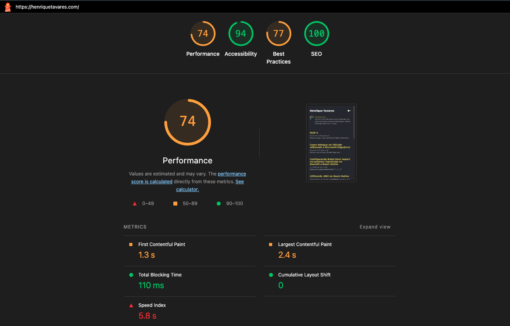
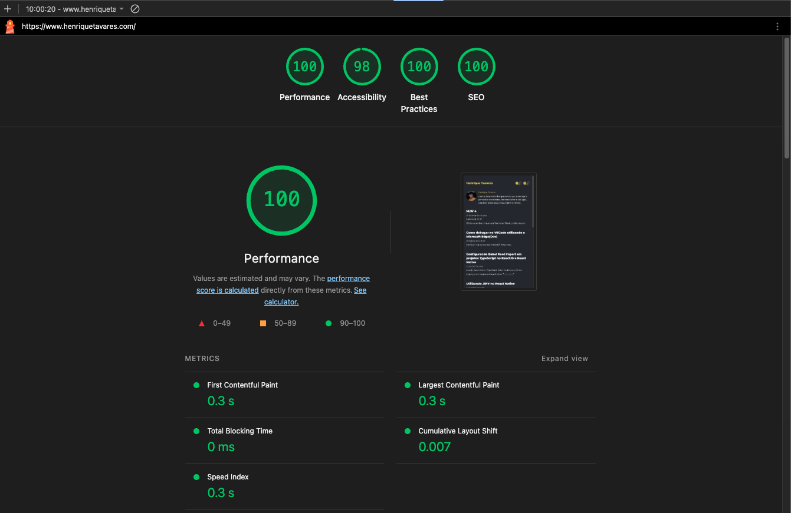

## Opa 🚀

Quem é vivo sempre aparece! Depois de 5 anos sumido daqui, resolvi tentar voltar e trazer alguns conteúdos novos que venho estudando e, obviamente, assim como 99% da comunidade, envolvendo IA.

Um grande conteúdo para esse 'comeback' seria a migração deste blog de Gatsby para Astro. Tenho este blog há aproximadamente 7 anos, e ele surgiu lá atrás de um fork inspirado no blog do Dan Abramov (inspirado é bondade, foi copiado mesmo). A tecnologia do blog do Dan na época era o Gatsby, um framework front-end que estava muito em alta no período em que foi criado.

Hoje não mais. O framework caiu em desuso; ainda funciona, mas está um pouco parado em nível de inovação. Então, este post registra a primeira versão da migração mais importante que já fiz neste blog desde que ele nasceu. A mudança principal foi técnica, não editorial: sair de uma base em Gatsby 2 para uma base estática em Astro.

E tem um detalhe que influenciou bastante a forma como essa decisão foi tomada: esta foi a minha primeira experiência real com Astro. Eu não escolhi Astro porque já dominava a stack ou porque queria experimentar algo novo por curiosidade. Pelo contrário: a escolha ficou de pé justamente depois de comparar alternativas e perceber que, mesmo sendo novidade para mim, ele parecia encaixar melhor no problema do que as opções mais familiares.

No mesmo movimento, a publicação acabou saindo do fluxo antigo e foi parar na Vercel, com o DNS ainda passando pela Netlify durante a transição operacional.

O objetivo aqui não é vender uma stack nem transformar a história em um tutorial passo a passo. A decisão registrada no projeto foi bem mais pragmática do que isso: fazer um reset de manutenção, preservar URLs e conteúdo, manter o blog reconhecível visualmente e remover tudo o que já não fazia sentido manter.

## Como estou tratando as evidências

Para manter este texto fiel ao projeto, estou separando os pontos em três grupos:

- **Fatos verificados do projeto**: PRD, TechSpec, ADRs, README, código atual e histórico da publicação na Vercel.
- **Contexto externo já registrado**: comparações e benchmarks que apareceram na ideação inicial, mas que não são medições deste repositório.
- **Inferências técnicas moderadas**: conclusões razoáveis a partir da arquitetura final e do histórico de deploy, sempre marcadas como inferência, não como fato absoluto.

Também vale uma correção importante: alguns rascunhos iniciais ainda falavam em preservar RSS e ilhas React para compartilhamento e tema. Essa não foi a direção final. Os ADRs finais, o README e a implementação consolidada apontam para outra linha: remover RSS e evitar hidratação desnecessária.

## O contexto real da migração

O blog original estava em Gatsby 2.x, uma stack que fazia sentido alguns anos atrás, mas que começou a ficar cara demais para um site que é, no fim das contas, um blog Markdown bilíngue sem backend. O próprio ADR principal da migração resume bem a situação: ecossistema estagnado, build lento na faixa de `~60-120s`, JavaScript demais para páginas totalmente estáticas e manutenção puxando energia demais para um projeto que deveria ser simples de publicar.

Além da idade da stack, existia outra camada de dívida técnica: o projeto carregava heranças visíveis do fork original. Havia referências antigas ao domínio e à marca do projeto-base, superfícies legadas como RSS, AdSense e páginas de newsletter, além de uma implementação de compartilhamento que já não justificava carregar dependências e comportamento de discussão quebrado.

O PRD transformou esse diagnóstico em uma regra de produto bem clara:

- preservar `9` slugs publicados;
- preservar `18` arquivos Markdown, um por idioma;
- manter português como idioma padrão e inglês sob `/en/`;
- evitar regressão de rota e de leitura;
- tratar dark/light mode como a única melhoria visível de V1;
- remover RSS, AdSense, `/thanks`, `/confirm` e links de discussão quebrados.

Em outras palavras: não era uma migração para "modernizar a marca". Era uma migração para voltar a publicar sem carregar uma máquina maior do que o blog precisava.

Também não foi uma decisão tomada no improviso. Boa parte do raciocínio e da documentação dessa migração passou pelo [Compozy](https://github.com/compozy/compozy), que me ajudou a estruturar a fase de estudo, consolidar PRD, ADRs, TechSpec e quebrar a execução em tasks menores. Eu gosto de pensar nele mais como um apoio para organizar pensamento e artefatos do que como protagonista da história. O centro continua sendo a migração; o Compozy entrou como acelerador de clareza.

## Por que Astro

Essa escolha foi registrada no `ADR-001`, que comparou Astro com Next.js App Router e Eleventy.

Isso importa ainda mais porque a decisão não saiu da zona de conforto. Se Astro tivesse sido escolhido só porque eu já estava acostumado com a ferramenta, o trade-off seria mais fraco. Aqui foi o contrário: como era minha primeira experiência de verdade com `.astro`, content collections e esse modelo mais explícito de composição, eu precisei justificar melhor a adoção. No fim, isso fortaleceu a decisão em vez de enfraquecê-la.

### Next.js foi descartado por excesso para esse caso

Já viu a história de bazuca para matar formiga? Então, foi como enxerguei o Next.js pra esse projeto. O principal argumento contra Next.js não foi "Next é ruim". Foi "Next resolve problemas que este blog não tem". O projeto não precisa de backend, autenticação, edge logic nem interface dinâmica rica. Colocar App Router em cima de um blog Markdown estático seria aceitar mais abstração e mais JavaScript sem ganho proporcional.

### Eleventy foi descartado por custo de reescrita

Eleventy fazia sentido do ponto de vista minimalista, mas aumentava o custo da migração porque exigiria uma reescrita mais ampla da camada de componentes e deixaria menos espaço para interatividade futura, caso algum dia ela volte a ser necessária. Bom, temos a interatividade dos Switch's de Tema e Linguagem, e isso era inegociável também.

### Astro encaixou no que o projeto realmente é

O encaixe com Astro veio de três pontos bem objetivos:

1. **zero JavaScript por padrão** para páginas estáticas;
2. **content collections com schema** para validar frontmatter;
3. **sobreposição boa com o ecossistema remark/rehype** que o blog já conhecia.

Para um blog que vive de Markdown puro, isso tira bastante atrito.

## Como a migração foi desenhada

O desenho final ficou bem mais simples do que a stack antiga.

### 1. Content collections com Zod

Os posts passaram a ser validados por schema, em vez de dependerem só de convenção tácita:

```ts
export const postFrontmatterSchema = z.object({
  title: z.string(),
  date: z.coerce.date(),
  spoiler: z.string(),
  tags: z.array(z.string()).optional().default([]),
  updateDate: z.coerce.date().optional(),
});
```

Isso resolve um problema pequeno, mas chato: blog Markdown costuma parecer simples ate o dia em que um frontmatter inconsistente quebra um build.

### 2. Uma pasta por post, dois arquivos por idioma

O projeto manteve uma convenção muito boa para um blog pequeno e bilíngue: cada post continua em uma pasta própria, com os assets ao lado do Markdown.

```text
src/content/posts/<slug>/
  index.pt-br.md
  index.md
  image.png
```

Essa decisão foi registrada no `ADR-003` e resolveu duas coisas ao mesmo tempo:

- preservou a ergonomia de autoria;
- reduziu o risco de quebrar imagens relativas durante a migração.

### 3. Helpers centrais para rotas e alternates

Em vez de espalhar regra de URL pelos templates, o projeto centralizou isso numa camada pequena de helpers:

```ts
export function postPath(slug: string, lang: Lang): string {
  const encoded = encodeUriSegments(slug);

  return lang === 'pt-br' ? 
    `/${encoded}/` : `/en/${encoded}/`;
}

export function postRouteMetadata(slug: string, lang: Lang): PostRoute {
  const path = postPath(slug, lang);
  const alternateLang: Lang = 
    lang === 'pt-br' ? 'en' : 'pt-br';

  return {
    slug,
    lang,
    path,
    canonical: path,
    alternate: postPath(slug, alternateLang),
  };
}
```

Isso é mais importante do que parece. Em blog bilíngue pequeno, boa parte da complexidade real nao esta no rendering, mas em manter paridade de rota, canonical e alternate sem escapar uma exceção boba.

### 4. Tema com script inline antes do paint

O `ADR-004` formalizou uma decisão que eu gosto bastante: nada de ilha React para resolver tema.

Em vez de depender de hidratação no cliente, o layout base aplica a preferência antes do primeiro paint:

```js
(function () {
  var stored = localStorage.getItem(THEME_STORAGE_KEY);
  var systemPrefersLight = window.matchMedia(
    '(prefers-color-scheme: light)'
  ).matches;
  var theme =
    stored === 'light' || stored === 'dark'
      ? stored
      : systemPrefersLight
        ? 'light'
        : 'dark';

  if (theme === 'light') {
    document.documentElement.classList.add('light');
  }
})();
```

Nao e um detalhe cosmético. Para o escopo do blog, isso entrega a funcionalidade com menos JS, menos dependência e menos risco de flash de tema.

### 5. `pnpm` como parte da simplificação operacional

Outro detalhe pequeno, mas coerente com a direção da migração, foi padronizar o fluxo operacional em `pnpm`. Não estou tratando isso como guerra de gerenciador de pacote nem como benchmark. A justificativa aqui é bem mais prática: a base atual ficou toda orientada a scripts simples e explícitos, e o projeto hoje mostra isso no próprio `package.json`.

O build principal virou:

```bash
pnpm build
```

E a verificação que melhor representa a rotina de manutenção ficou assim:

```bash
pnpm validate
```

Esse `validate` encadeia lint, build e auditoria de migração. Para mim, esse tipo de fluxo ajuda a comunicar melhor como o projeto deve ser mantido. Mais do que "usar `pnpm` em vez de `yarn`", a decisão aqui foi deixar a rotina operacional mais legível e consistente com a base enxuta que o Astro permitiu montar.

### 6. A biblioteca antiga de share saiu, links estáticos entraram

O compartilhamento continuou existindo, mas de forma mais honesta com o projeto:

- sem a dependência antiga de compartilhamento;
- sem ilha React;
- sem carregar comportamento de discussão quebrado;
- só links estáticos para redes externas.

Foi uma troca pequena em interface e grande em manutenção.

## Os trade-offs que vieram junto

Nem tudo ficou "melhor" em todo eixo. A migração trocou um conjunto de problemas por outro conjunto menor e mais controlável.

### i18n manual

Astro não entrou aqui como solução mágica de i18n. O projeto assumiu um modelo manual e explícito de idioma por arquivo, rota por helper e paridade por auditoria. Para este blog, isso é aceitável. Para uma aplicação com mais idiomas e mais conteúdo, provavelmente deixaria de ser.

### Risco de drift visual

Sair de `Typography.js` + `SCSS` para `Tailwind` significava aceitar algum grau de drift visual. O `ADR-004` deixa isso explícito: a meta era **continuidade visual próxima**, não reprodução pixel-perfect da stack anterior.

Esse talvez tenha sido o trade-off mais maduro da migração. Em vez de gastar energia recriando a implementação antiga nos mínimos detalhes, o projeto preservou o que importava mais: sensação de leitura, layout, tema, código e identidade geral.

### Assets relativos exigem disciplina

Mover Markdown de lugar quase sempre revela imagem quebrada, link relativo estranho ou suposição antiga do pipeline anterior. Por isso a decisão de manter assets colocalizados foi tão importante. Ela não elimina o risco, mas reduz bastante a chance de a migração virar caça ao bug invisível.

### Validação focada, não automação pesada

O `ADR-005` escolheu uma linha bem específica para validação:

- `lint`;
- `build`;
- auditoria de rotas, conteúdo, pares de tradução e referências legadas.

Lighthouse e revisão visual continuaram como gate de release, mas não foram jogados imediatamente dentro de uma automação pesada de CI com screenshot diff e pipeline inchado.

Eu considero isso uma decisão boa para V1. Inferência moderada: para um blog estático com poucas rotas e escopo controlado, a automação mais valiosa era a que protegia regressão estrutural, não a que aumentava cerimônia.

## Netlify para Vercel: uma mudança operacional acoplada

Aqui existe uma nuance importante: os ADRs do projeto documentam muito melhor a migração de framework do que a troca de plataforma de deploy. Entao eu estou tratando esta parte com uma mistura de fato verificado e inferência moderada.

### Fato verificado

Pelo histórico de publicação, o fluxo final ficou assim:

- o site builda estaticamente em `dist`;
- a Vercel passou a servir o projeto em produção;
- durante a transição, o DNS autoritativo ainda estava delegado para a infraestrutura da Netlify (`nsone`);
- o domínio `henriquetavares.com` e o `www` foram validados na Vercel enquanto a zona DNS continuava sendo ajustada fora dela.

Na prática, isso produziu uma situação curiosa e bem comum: a hospedagem já estava certa, mas a resolução DNS ainda brigava com cache local e com a delegação antiga.

### Inferência moderada

Mesmo sem um ADR exclusivo para **"Vercel vs Netlify"**, a escolha faz sentido pelo contexto final do projeto:

- o output do Astro é estático e simples;
- a configuração de build é direta (`pnpm build`, saída em `dist`);
- a publicação na Vercel encaixa bem no fluxo de preview e domínio customizado;
- a base nova ficou mais alinhada com um deploy sem camadas legadas sobrando.

O que eu **não** vou afirmar aqui, porque não está documentado nas fontes que usei:

- custo melhor;
- performance de edge melhor;
- CI/CD mais barato;
- qualquer número comparando Vercel e Netlify em produção.

Essas afirmações até poderiam ser verdade em outros contextos, mas não são fatos comprovados deste projeto.

## Resultados observáveis

### O que está documentado no projeto

Os resultados mais sólidos desta migração são estes:

- o inventário de conteúdo foi preservado: `18` arquivos Markdown e `9` pares de tradução;
- as rotas seguem o modelo original: `/` e `/<slug>/` para PT-BR, `/en/` e `/en/<slug>/` para EN;
- o build registrado na decisão técnica sai da faixa de `~60-120s` no Gatsby para `~8s` no Astro;
- o objetivo arquitetural sai de uma base que enviava cerca de `~300 KB` de JavaScript em páginas estáticas para um modelo em que Astro entrega zero JS por padrão, mantendo apenas um script inline mínimo de tema e links estáticos de compartilhamento.

So esses quatro pontos ja mudam bastante a experiência de manter um blog.

### O que ficou como evidência operacional

O histórico da publicação também deixou duas evidências práticas:

1. a nova base foi publicada em Vercel com domínio próprio;
2. a transição expôs um detalhe operacional real: hospedagem e DNS podem morar em provedores diferentes por um tempo, e isso pode gerar sintomas locais estranhos mesmo quando a configuração autoritativa já está correta.

Isso não é exatamente um "benchmark", mas é o tipo de aprendizado que normalmente não aparece no README e sempre aparece no mundo real.

### Lighthouse: antes e depois

Aqui, sim, eu já tenho uma evidência concreta do projeto: as capturas versionadas junto deste post. Elas não são benchmark universal, nem promessa de que qualquer site vai repetir o mesmo resultado. São apenas o recorte honesto desta migração, nessas páginas e nessas rodadas de medição.





O comparativo mais visível ficou assim:

- **Performance**: `74` -> `100`
- **Accessibility**: `94` -> `98`
- **Best Practices**: `77` -> `100`
- **SEO**: `100` -> `100`

E, olhando as métricas mostradas nas próprias capturas:

- **First Contentful Paint**: `1.3s` -> `0.3s`
- **Largest Contentful Paint**: `2.4s` -> `0.3s`
- **Total Blocking Time**: `110ms` -> `0ms`
- **Speed Index**: `5.8s` -> `0.3s`
- **Cumulative Layout Shift**: `0` -> `0.007`

O CLS merece uma leitura cuidadosa: ele saiu de `0` para `0.007`, ou seja, piorou numericamente, mas continua em uma faixa extremamente baixa e saudável. O resto do conjunto mostra uma melhora bem mais contundente no tempo até conteúdo útil, no bloqueio da thread principal e no carregamento percebido.

Então, diferente da versão anterior deste texto, agora dá para dizer com segurança: além de a arquitetura nova fazer sentido em tese, ela também deixou uma evidência prática de melhora nas medições do próprio projeto.

## Contexto externo que ajuda, mas não prova o caso sozinho

Na ideação inicial do projeto apareceram comparações externas favoráveis ao Astro, como:

- melhor perfil de Core Web Vitals em levantamentos públicos;
- builds mais rápidos em comparações com geradores tradicionais;
- vantagem de zero JS por padrão.

Esse contexto ajuda a entender por que Astro parecia uma boa aposta. Mas ele continua sendo isso: **contexto externo**. O que realmente justifica a decisão aqui é o encaixe com este blog específico, não um benchmark genérico de internet.

## O que aprendi com essa migração

Se eu tivesse que resumir a principal lição, ela seria esta: muita migração dói porque tenta resolver dívida técnica e reposicionamento de produto ao mesmo tempo.

Aqui funcionou melhor porque a regra foi mais disciplinada:

- primeiro, preservar o que ja funcionava;
- depois, remover o que so existia por herança;
- só então introduzir a menor melhoria visível que realmente valia o custo.

Outra lição importante: "menos JavaScript" só é um resultado bom quando vem acompanhado de menos complexidade operacional e menos fricção editorial. Neste caso, veio.

E eu acrescentaria mais uma coisa: aprender Astro pela primeira vez, com apoio estruturado do Compozy e com uma rotina operacional simples em `pnpm`, me lembrou que simplificar um projeto não é só reduzir dependência ou payload. É também reduzir hesitação para estudar, decidir, validar e manter.

## Quando uma migração parecida faz sentido

Eu consideraria uma migração assim quando quase todos estes pontos forem verdade ao mesmo tempo:

- o site é majoritariamente estático;
- o conteúdo ainda vive bem em Markdown;
- a stack atual consome energia demais para publicar pouco;
- o deploy depende mais de legado do que de requisito real;
- a meta não é redesenhar tudo, e sim voltar a ter uma base saudável.

Se o seu projeto depende muito de runtime dinâmico, backend acoplado, i18n sofisticado ou interatividade frequente no cliente, talvez esse tipo de simplificação não encaixe tao bem. Mas para blog estático bilíngue com escopo enxuto, o ganho pode ser bem imediato.

## Fechando

No fim, esta migração não foi sobre trocar Gatsby por Astro porque "Astro está na moda", nem sobre trocar Netlify por Vercel porque "uma plataforma venceu a outra". Foi sobre alinhar a infraestrutura e a arquitetura com o que este projeto realmente é hoje.

Um blog pequeno, bilíngue, estático, escrito em Markdown, que precisa ser fácil de manter e agradável de publicar.

Quando a stack deixa de ajudar e começa a cobrar pedágio, migrar deixa de ser vaidade técnica e vira manutenção básica.

Sendo assim, vamos ver se resolve o principal problema, que é eu voltar a escrever.

Obrigado pelo tempo. 🚀
