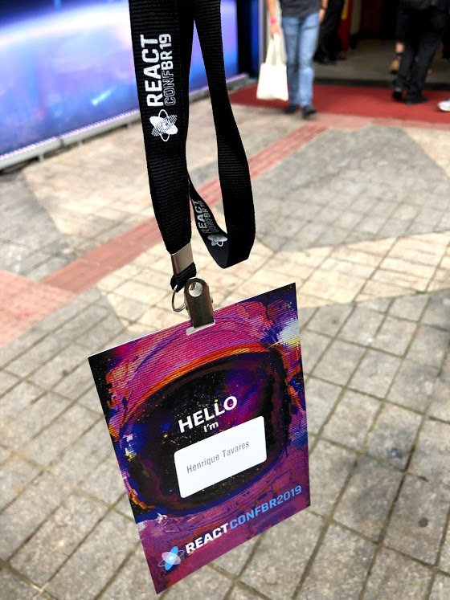
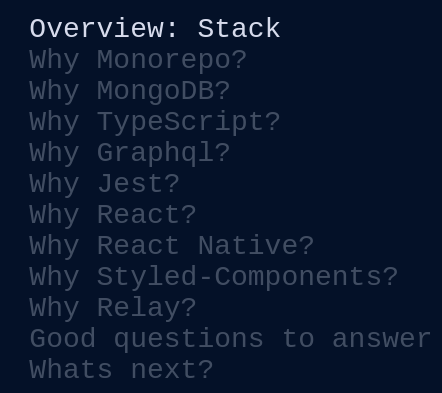

## Heeeeeeeey Codeeeeers!!

I'm back, in October I was on vacation, so I decided to make the most of it and I took a break from the routine, I was going out of a frantic routine, I kind of needed it, I was about 3 weeks without opening VSCode hehehehehe 😬.

Buuuuuut that does not mean that I was stopped, during the holidays I enjoyed and went to the 3rd edition of React Conf that happened in São Paulo on October 19th, 2019, and this is what I came to tell you a little about the things that I saw it there, but in a nutshell.

# React Native (Comparison with Flutter)

[Andrei Calazans](https://twitter.com/andrei_calazans), who is a highly regarded guy when it comes to React Native, has brought some of the comparison between React Native and his "enemy" Flutter.

The talk was not meant to say which was the best, but rather the advantages of each depending on the project you are developing. Of course, the market for React Native is much more hectic, besides the fact that using Javascript, which is one of the most commonly used languages today by programmers, you can reuse the same code you developed in React for a web application, with some minor modifications, obviously, to develop mobile.

But Flutter is not far behind, after Nubank(a bank that operates in Brazil) decided to join it, it has grown enormously in the Brazilian market. There are great advantages of it over apps made in React Native, and vice versa, so, as André made clear, it's a matter of knowing what the purpose of your project is, so that you decide what technology to use, but Always aware that no matter what choice you make, you will not be left behind.

Particularly, during the talk, I understood that for performance reasons, Flutter is a little, but very little, ahead of React Native, but the React Native community knows this, and they are working to improve this issue even more.

**Talk Slide:** https://slides.com/andreicalazans/the-state-ofreact-native#/

# Performance with React
Performance with React was a very interesting talk hosted by Larissa Thaís, which makes us think 2, 3 or 4 times about the projects we are working on or are working on.

She begins by asking, "Does your system do well?"

But within that question, there are other questions...

Calm down, come on, if your answer is positive to all of these questions below, you are on a super right path.

* Does your project have a favorable Loading Time?

* Does your project have a good flow?

* Is the bundle size good?

* Does it work correctly? No mistakes?

* Is the error response time for the user fast?

* How good is it when displaying multiple items on screen?

* Does your project enable you to do more in less time?

* Have a steady stream of new users?

These are very important questions that you should always be asking not only at the end of the project, but all the time if you have made a new feature, re-ask these questions, which I am sure will help you.

Again, she asks, **But why bother me with this (performance)?**

She highlights 2 interesting topics about this question and I will explain why, which are:

* "Performance influences user perception of quality".

  _**That is, if you have a fast and performative system that when a user needs to perform a particular action, he simply goes there and does, without delay, without prolonging, the user has a very positive view of the product company. The system does not have to guess what the user will do, it just needs to do it.**_

* "You won't have a user saying," The reporting page is taking too long because of the images."

  _**Easy peasy yeah? if the problem came with the solution half of our programmer service would be ready. To rephrase, the user would just say: "̶E̶h̶i̶s̶ ̶f̶u̶c̶k̶i̶n̶g̶ ̶s̶y̶s̶t̶e̶m̶ ̶i̶s̶ ̶s̶h̶i̶t̶" ... "This system is too slow"**_

To be more straightforward, she outlines some tips for making an objective analysis, which are:

* Minification;
* Code splitting;
* Image optimization and or booking an image server;
* Cache utilization;
* Asynchronous requests;
* Debounce in text fields;
* Review the query time of the bank;
   * **Only moving the front is no miracle, if your problem is loading request the backend has to put his hand too**

Thinking about the React components she leaves some tooltips:

**React DevTools:** To check what you have to update in virtual-DOM;

**Highlight Updated Options:** Checking unnecessary renders

It also recommends isolating frequent update regions, such as a timer, and whenever possible using PureComponet's or React.Memo.

**Talk Slide:** https://drive.google.com/file/d/1FTihjdURKDD34UbB7whJnPsIcumgatix/view

# The Golden Stack
It was a very interesting talk also presented by [João Marins](https://twitter.com/jgcmarins), it highlights the stack that is used by [Foton](https://twitter.com/fotoncompany).

I will give you a quick look at each of these little questions answered by him and with some points of mine.

**Why Monorepo?** I am not an expert on Monorepo, in fact, I need to go deep, I am not very reputable with the theme, but João explains that they decided to adopt Monorepo for practicality and a few more things that I I prefer not to go deeper because of what I said at the beginning.

**Why MongoDB?** MongoDB was a decision because it is a NoSQL database, so they decided to adopt it. I have already worked with MongoDB on particular projects, and I love it, besides having a great learning curve is very simple for those who are starting to move and for those who are already moving.

**Why TypeScript?** TypeScript was one of the subjects that caught my attention in React Conf Brazil 2019, a lot of people have been adopting TypeScript in new projects instead of Javascript. All this is due to the fact that TypeScript gives you more security, and it was one of the reasons I was in John's stack, and there I was sure it was time for me to start digging into TypeScript.

**Why GraphQL?** Another technology that caught my attention during React Conf Brasil 2019 with TypeScript was GraphQL not only new projects are adopting but old projects are migrating, the most spoken phrase there was that “GraphQL is here to stay”, so needless to say nothing more. João pointed out that REST was an evolution of SOAP and GraphQL an evolution of REST that is here to stay.

**Why Jest?** Jest was one of the most mentioned test tools by most speakers, I already use Jest, and it just made me more sure I'm on the right track.

**Why React and React Native?** Really? do i really need to talk? But I've said so much ... but, in short, the fact that you can reuse code from both to develop is something out of the ordinary, and it's one of the thousands of advantages of having React and React Native in your stack

**Why Styled-Components?** One of the great loves of my life is this little guy there. I was even thinking of bringing a post of his own here, so much that I like it. I tell my colleagues that I can't handle CSS anymore if I don't use Styled-Components, and there it also made me sure that it is very high in the market, it is in the stack of big developers and big companies like João and Foton.

These palettes only made me sure that where I work at [Zaal](https://www.zaal.com.br/) and what I have been studying and deepening is on the right track, we have not yet adhered to all tools on the list, but more than half are in use, and some with future plans.

**Talk Slide:** https://jgcmarins.github.io/the-golden-stack/#0

# From Enzyme to Testing Library
[Pablo Dinella](https://twitter.com/pablordinella) highlighted the important difference between using Enzyme and Testing Library.

If you don't know Testing Library is a very lightweight solution for testing React components. It provides light utility functions on top of ReactDOM in a way that encourages best test practices. The idea of this library is to serve as a replacement for Enzyme.

I once heard a phrase that said, "For you to be a senior programmer, you must be in the habit of writing daily tests," and this presentation just made me more sure of that.

Well, he points out that Enzyme can:

    * browse the components tree;
    * make selections (CSS selectors, component name ...);
    * access props and state;
    * execute methods;

And it says the things that the testing library does NOT do:

    * Shallow rendering shallow ()
    * Static rendering render ()
    * Component tree navigation
    * Get component instance
    * Access and set props
    * Access and set state

"These are all things the end user can't do, so your test shouldn't do either"

It goes deeper and makes the characteristic of each explicit:

* Enzyme
  * Based on component return
  * Facilitates component tree navigation
  * Simulates interactions
  * Tests implementation

* Testing Library
  * Based on rendered DOM
  * Has "humanized" selectors
  * Interactions on DOM Nodes
  * Forehead from thin user point of view

**Talk Slide:** https://slides.com/pablo-dinella/do-enzyme-ao-testing-library#/

# ReasonML
ReasonML gave what to say at React Conf Brasil 2019, I had never heard before, it was presented by [Gabriel Rubens](https://twitter.com/fakenickels) in a very humorous and very straightforward presentation.

For those who are like this down there like me and have never heard of ReasonML, I will try to explain quickly.

ReasonML is nothing more than the new programming language of ... Facebook.

To summarize well, but really, ReasonML is object-functional programming language, it's a new C-type syntax for OCaml programming language. This new syntax focuses on facilitating JavaScript interoperability and the adoption of JavaScript programmers. In addition, it removes idiosyncrasies from OCaml syntax.

Gabriel made it very clear in the presentation that it is practically impossible to compile error code using ReasonML, I've seen it before in Delphi hehehehehe

Just kidding, so why was the talk so "controversial"?

Well, in the end the audience could ask questions regarding the presentation, and Gabriel was very asked if it was worth studying this new language, because in Javascript we "suffered" with the thousands of things that come up, we can not but study 1 day if you want not to be left behind.

So would it be time well spent studying this new language?

Or should we focus on what we are already studying, like Javascript itself, TypeScript etc?

It has generated a debate, but just like everything else in life, everything has its pro and con side, so I leave below the Gabriel slide presentation link and a very good ReasonML article if you are interested in drawing your own conclusions.

**Talk Slide:** https://es2077-reactconf.netlify.com/0

**Article:** https://blog.logrocket.com/what-makes-reasonml-so-great-c2c2fc215ccb/

# Gatsby
Finally, it was also the talk that ended React Conf Brasil 2019, [Preston So](https://twitter.com/prestonso) that came straight from New York ** (seriously, he arrived from the airport and went to talk) **, talked about Gatsby today and Gatsby in the future.

For those who do not know what Gatsby is, Gatsby is a very fast React based website building framework.

And for those who don't know too, my blog is made in Gatsby.

One of the main points was when he announced that Gatsby is working to improve builds, because when you have a site with many pages, it takes a long time for everything to be "built", they are aware of it, and are looking for this improvement for an upcoming release.

In addition, the Gatsby Preview which is still in beta was also announced.

# Finishing
Well, Coders, that's it, I could talk a lot more, but I think the main one I brought here, I hope so. It was a unique experience, and I hope to be back next year to find out what's coming.

I would like to thank my friend [Elan](https://github.com/elanfraga) for contributing and helping me to remember some points.

I would like to recommend reading about React Conf 2018 very interesting from the g2i team.

[Summary of React Conf Brazil — 2018](https://www.g2i.co/blog/react-conf-brazil-2018)
[What I learned at ReasonConf 2018](https://www.g2i.co/blog/what-i-learned-at-reasonconf-2018)

See you later!

