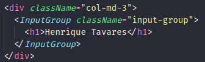
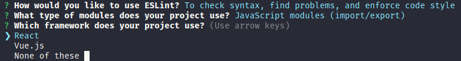

## Faaaaala Codadores!!

*__Obs.: Essas configurações foram testadas somente no VSCode.__*

Vem cá, a não ser que você tenha a inteção de fazer um `Hello World` utilizando o ReactJS, eu tenho certeza que você sempre utiliza um padrão de código em seus projetos em ReactJS, estou certo?

Então é aí que entra o `ESLint`, e o `Prettier`.

Mas antes, você sabe o que são esses nomes esquisitos?

## Que raios é esse ESLint?
---


ESLint é resumidamente uma ferramenta de linter plugável para JavaScript e JSX. 

- **"Mas Henrique, o que é linter???? Você não está ajudando assim! 🤬"**


Tem razão, meu caro digitador de linhas, `linter` nada mais é do que um um fiscalizador de código, ou seja, ele vai análisar o que você digitou e vai te dar sugestão de melhorias nesse código. Melhorou agora? 

É basicamente igual aqueles sublinhados que vemos no Microsoft Word quando escrevemos alguma coisa errada, por exemplo.


Isso facilita a você deixar seu código padronizado não só pra você, como pra toda sua equipe.

 ### Código Pré ESLint


 ### Código Pós ESLint

 

Repare que o código fica muito mais dahora!

## Prett ... o que? Prettier?
---
  Achou que tinha acabado a parte conceitual né?


 

---

Vou ser rápido, prometo!

Não, Prettier não é um prato francês, Prettier é basicamente um formatador de código. Ele impõe um estilo consistente analisando o seu código e formatando ele com suas próprias regras.

Então deu pra perceber que o ESLint e o Prettier apesar de um não precisar teoricamente um do outro para funcionar, são extremamente úteis quando utilizados em conjunto.

## Configurando o ESLint
---

Chega de conceito, hora de codar, sei que você estava ansioso!

 

 ---


> Primeiro você adiciona ele ao seu projeto:

```jsx{}
yarn add eslint -D
```

> Então, você inicia ele:

```jsx{}
yarn eslint --init
```

**Agora irá abrir no seu terminal algumas opções, vamos a elas:**

> **Passo 1:** Pra começar é questionado como você quer usar o ESLint, a gente escolhe a terceira opção que diz: `To check syntax, find problems, and enforce code style`. Ou seja, ele irá verificar a sintaxe, encontrar problemas e impor o estilo de código.


> **Passo 2:** Agora é questionado que tipo de módulo nosso projeto usa, e como já sabemos, ReactJS trabalha com `import/export`, então selecionamos a primeira opção.


> **Passo 3:** Bom essa é fácil né? Qual framework nosso projeto usa? ~~Vue.js~~ React é lógico.



> **Passo 4:** Aqui é questionado onde nosso projeto roda, então deixamos do jeito que está e selecionamos `Browser`.


> **Passo 5:** Aqui questiona como preferimos definir o estilo para o nosso projeto, selecionamos a primeira opção: `Use a popular style guide`, iremos usar um estilo popular, já existente.


> **Passo 6:** Vamos escolher o estilo do [**Airbnb**](#style-guide-do-airbnb), daqui a pouquinho eu explico o motivo, calma aí, só segue o baile. ~~Ou clica ali no Airbnb sue ansioso~~


> **Passo 7:** Nesse passo selecionamos `JavaScript` para que ele crie o arquivo de configuração do ESLint no formato `JS`.


> **Passo 8:** Por último ele questiona se você quer instalar via npm, infelizmente não temos escolha, dá um `yes(Y)` aí.


Pronto! É só isso?


Depois que terminar a instalação, irá criar um arquivo `package-lock.json`, no último passo quando você aceita que ele instale com o `npm`, ele instala, mas cria esse arquivo, então... 

> **Passo 9:** Delete o arquivo `package-lock.json` e execute o comando `yarn` para adicionar as dependências novamente, mas dessa vez, pelo yarn.

> **Passo 10:** Por último, instale as depêndencias do `Prettier`, mais as dependências do Prettier com o ESLint como dependências de desenvolvimento`(-D)`:

```jsx{}
yarn add prettier eslint-config-pretier eslint-plugin-prettier babel-eslint -D
```

Agora sim!!

Estamos quase lá, agora é só editar os arquivos de configurações!

## Arquivos de Configurações
---

Repararam aí que na raiz do seu projeto apareceu um arquivo chamado `.eslintrc.js`?


Pois é, é esse amiguinho ai que vamos alterar, abra ele, e cole esse código:

```jsx{1}
// .eslintrc.js
module.exports = {
  env: {
    browser: true,
    es6: true
  },
  extends: ["airbnb", "prettier", "prettier/react"],
  globals: {
    Atomics: "readonly",
    SharedArrayBuffer: "readonly"
  },
  parser: "babel-eslint",
  parserOptions: {
    ecmaFeatures: {
      jsx: true
    },
    ecmaVersion: 2018,
    sourceType: "module"
  },
  plugins: ["react", "prettier"],
  rules: {
    "prettier/prettier": "error",
    "react/jsx-filename-extension": ["warn", { extensions: [".jsx", ".js"] }],
    "import/prefer-default-export": "off"
  }
```

Não irei entrar muito em detalhes, mas esse código, basicamente, configura para que seu Prettier e ESLint tabalhe em conjunto, ou seja, nas rules aí estamos dizendo que:

  - **"prettier/prettier": "error"** - O Prettier irá apontar todas as regras que ele não encontrar como um erro;
  - **"react/jsx-filename-extension": ["warn", { extensions: [".jsx", ".js"] }]** - basicamente permite que a gente escreva código `jsx` em arquivos `js`;
  - **"import/prefer-default-export": "off"** - Essa regra diz que quando o arquivo tenha apenas um `export` dentro de um arquivo, ele seja obrigatoriamente um `export default`. Então, eu desabilito porque existe casos, que não necessariamente, eu quero que seja default.

Pronto, o seu ESLint já está configurado, pronto pra uso, e para finalizar falta só fazer uma configuração rápida para o Prettier.

Crie um arquivo na raiz do seu projeto chamado: `.prettierrc`

Copie o código abaixo para dentro desse arquivo:

```jsx{1}
// .prettierrc
{
  "singleQuote": true,
  "trailingComma": "es5"
}
```

Esse código basicamente, diz que iremos usar aspas simples no projeto, e isso é tudo para que o Prettier e a Style Guide do Airbnb se comuniquem melhor.

Pronto, tudo configurado, se era só isso que você queria, encerramos por aqui, até uma próxima, agora para os curiosos, eu irei explicar, como o prometido, o motivo pelo qual eu escolhi a Style Guide do `Airbnb`.

## Style Guide do Airbnb
---

O style guide do Airbnb é um dos mais famosos do mundo, ele é usado e apoiado pelas grandes empresas, incusive o próprio React o recomenda. O estilo de código adotado por eles, é um dos mais aclamados pela comunidade, por isso é o mais famoso do mundo, é como a lingua inglesa no mundo, ou seja, é um padrão mundial. E quando se trata de padrão mundial, não há discusões. Eu particulamente utilizo ele somente nos meus projetos em ReactJS e React Native, em NodeJS eu utilizo outro, posso estar trazendo um artigo futuro sobre isso.

## Finalizando
---

Acho então que ficou claro da importância de um linter no seu código, correto?! E apesar dos passos serem longos para realizar as configurações, acaba sendo um processo bem fácil e tranquilo!

Então, codadores, é isso! Até uma próxima!

